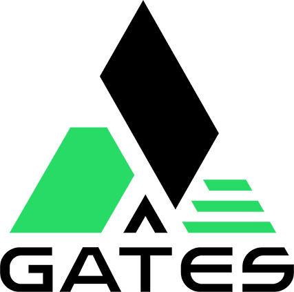

<p align="center">
  <picture>
    <source media="(prefers-color-scheme: dark)" srcset="assets/500nonwhite.png">
    
  </picture>
</p>

# GATESOFT — Ultimate Files Converter
**Version: ALPHA 0.4 Pre-Release**


[](https://github.com/pincakez/GATESoft-UFC)
[](https://github.com/pincakez/GATESoft-UFC)

> **Universal AI-powered file conversion engine**. Natively supports ingesting and exporting between PDF, DOCX, ODT, TXT, Markdown, PNG, and JPG. Optimized for Arabic (RTL) and multilingual documents with full table, heading reconstruction, and AI-driven Rephrasing/Grammar enhancement. Powered by Google Gemini API with intelligent rate limiting and instantaneous text-to-image rendering.

---

## ✨ Features

- **Universal Any-to-Any Converter**: Input **and** Output in PDF, DOCX, ODT, TXT, MD, PNG, and JPG.
- **AI-Powered Semantic Extraction**: Google Gemini API analyzes document structures, handwriting, tables, and nested content.
- **Text-to-Image AI Rendering**: Enhance your grammar/vocabulary and immediately export the reconstructed elegant document as a new PNG/JPG.
- **Native Browser Processing**: Parses Word (Mammoth.js) and OpenDocument (JSZip) files locally with zero backend uploads!
- **Arabic & RTL Support**: Full Right-to-Left text handling with bi-directional (`bidi`) paragraph attributes.
- **Intelligent Error Recovery**: Auto-retry on rate limits (429), server overload (503), with dynamic repetition loop detection.
- **Thinking Modes & Enhancements**: Trade speed for accuracy using reasoning delays, Rephrase, and Grammar correction.
- **Questions Auto Answer**: Built-in classroom intelligence that identifies and solves questions within documents.
- **Precision Alignment**: Global control over text direction (AUTO, RTL, LTR, CENTER) for perfect semantic output.

---

## 🗂 Project Structure

```
GATESoft-UFC/
├── index.html               ← Main entry point (clean, modular)
├── css/
│   └── styles.css           ← All styles (light & dark themes, model selector)
├── js/
│   └── app.js               ← All logic, model configs, Gemini API integration
├── assets/
│   └── 500nonblack.png      ← GATESOFT logo
└── README.md                ← This file
```

---

## 📋 Prerequisites

- **Web Browser**: Chrome, Edge, Firefox, or Safari (latest versions recommended)
- **Google API Key**: Free tier from [Google AI Studio](https://aistudio.google.com/app/apikey)
- **Local Server**: Live Server extension (VS Code) or any local HTTP server (needed to avoid PDF.js CORS issues)

---

## 🚀 How to Run

### Option 1: VS Code Live Server (Recommended)
1. Open the `Z` folder in VS Code
2. Right-click `index.html` → **"Open with Live Server"**
3. App opens at `http://127.0.0.1:5500/index.html`

> Live Server extension (`ritwickdey.LiveServer`) is already installed.

### Option 2: Direct Browser File
- Open `index.html` directly in Chrome or Edge
- ⚠️ PDF.js may have CORS issues with some local PDFs via `file://`
- **Recommended:** Always use Live Server for reliability

### Option 3: Python Simple HTTP Server
```bash
cd Z
python -m http.server 8000
# Open http://localhost:8000/index.html
```

---

## 🔑 API Key Setup

1. Go to [Google AI Studio](https://aistudio.google.com/app/apikey)
2. Create a free API key (starts with `AIza...`)
3. Paste it into the **API KEY** field in the app (Step 1)
4. Choose your preferred AI model (Step 2)
5. Upload a PDF and start converting (Step 3)

---

## ✅ Bug Fixes & Changes Applied

### 🔧 Model Name Fixed (the main error you saw)
The original code used a **non-existent model ID** that caused:
```
models/gemini-2.5-flash-lite-preview-06-17 is not found for API version v1beta
```
The app now defaults to `gemini-3.1-flash-lite-preview` and lets you switch between all supported free-tier models.

### 🔄 UI & UX Polishing
- Completely rebuilt the Processing Logs UI for readable wrap-around dynamic status messages.
- Added smooth window auto-scrolling on execution.
- Wired the **Stop Conversion** button to an `AbortController` to instantly sever live LLM network requests!
- Fluid CSS animations prevent stiff transitions and bring the queue rendering to life.

### 🌐 Universal Extractor & Render Pipeline
- Shifted the architecture from "PDF to X" to **"Any to Any"**.
- Input vectors like DOCX/ODT are parsed locally into semantic strings, fed directly to Gemini via text parameters (bypassing heavy image rasterization tokens), and natively reassembled.
- Exporting AI-processed text direct to PNG uses a lightweight `html2canvas` render engine.

### 📁 Externalized Files
CSS → `css/styles.css` · JavaScript → `js/app.js` · Logos → `assets/`


---

## 🤖 AI Models (Free Tier)

Step 2 in the app lets you choose your model. Each model gets a **calculated safe delay** between pages to avoid hitting rate limits.

| Model | API Identifier | RPM/RPD | Delay | Thinking? | Best For |
|---|---|---|---|---|---|
| ⚡ **Gemini 3.1 Flash-Lite** | `gemini-3.1-flash-lite-preview` | 15 / 1K | **6s** | ✅ Yes | Simple & medium docs, fast |
| 🚀 **Gemini 2.5 Flash-Lite** | `gemini-2.5-flash-lite` | 15 / 1K | **6s** | ❌ No | ✨ Dense Arabic text & bulk docs |
| 🎯 **Gemini 2.5 Flash** | `gemini-2.5-flash` | 10 / 500 | **8s** | ✅ Yes | Complex layouts, mixed languages |
| 🔬 **Gemini 3 Flash (Preview)**| `gemini-3-flash-preview` | 10 / 250 | **8s** | ✅ Yes | Handwriting, max quality |

**Delay formula & Error Handling:** 
- Delays: `60s ÷ RPM + 2s safety buffer`
- **429 Rate Limits**: Retries up to 3 times with exponential back-off (delay `x1`, `x2`, `x3`).
- **503 Server Overloaded**: Preview models frequently hit 503 errors. The app automatically waits longer (`x2`, `x4`, `x6`) and retries.
- **Repetition Loop Detector**: Dense Arabic text sometimes traps lower-tier models in "repetition loops". The app actively scans output for repetition patterns and auto-retries the page with increased thinking level or a different model if needed.

> **Note:** Delays are only inserted between AI-processed pages. PNG/JPG exports skip the delay entirely.

---

## 📄 Supported Input & Output Formats

| Format | Description (Input & Output Support) |
|--------|-------------|
| **DOCX** | Microsoft Word, RTL-aware, Arabic fonts, full table support |
| **ODT** | OpenDocument Text (LibreOffice) |
| **TXT** | Plain text, minimal formatting |
| **MD** | Structured Markdown with headings and tables |
| **PNG / JPG** | Renders documents to image. If Enhancements are ON, uses AI to create custom graphic outputs. |
| **PDF (Split)** | Slices PDF pages into rasterized individual Image files (no AI call) |
| **PDF (Reconstruct)** | AI deeply extracts content → Markdown → HTML → print to PDF pipeline |

---

## ⚙️ AI Enhancement Options

### Scan Resolution (DPI)
| Setting | DPI | Use Case |
|---------|-----|----------|
| DRAFT | 72 | Fast preview, simple text |
| BALANCED | 100 | General documents |
| QUALITY *(default)* | 150 | Complex layouts, Arabic text |

### Thinking Level
Some models (like 2.5 Flash-Lite) do NOT support thinking. When selected, thinking options are hidden. For models that do support it, a **REC** tag marks the recommended level.

| Level | Description |
|-------|-------------|
| OFF | Fast, great for clear printed text |
| LIGHT | Light reasoning for semi-clear documents |
| STANDARD | Careful analysis of ambiguous content (Great for 2.5 Flash & complex Arabic) |
| DEEP | Deep spatial analysis — handwriting, complex tables, noisy scans |

### Output Alignment
| Mode | Description |
|------|-------------|
| **AUTO** | Automatic detection based on content (defaults to RTL) |
| **RTL** | Forces Right-to-Left alignment (Best for Arabic/Hebrew) |
| **LTR** | Forces Left-to-Right alignment (Best for English/Latin) |
| **CENTER** | Centers all text elements, tables, and headings |

### Text Enhancement (Optional)
- **Rephrase** — rewrites sentences for clarity while preserving meaning
- **Grammar Correction** — fixes spelling and grammar without rephrasing
- **Questions Auto Answer** — AI inferrs course/subject context to identify and solve questions inside the document

---

## 🌐 RTL & Arabic Support

- Full Right-to-Left reading order detection
- Arabic text rendered with `Traditional Arabic` font in DOCX/ODT output
- BiDirectional (`bidi`) paragraphs in Word documents
- Tables reconstructed with correct cell alignment

---

## 📦 Dependencies (CDN — no install needed)

| Library | Version | Purpose |
|---------|---------|---------|
| [PDF.js](https://mozilla.github.io/pdf.js/) | 3.11.174 | Displaying and rasterizing PDF inputs |
| [Mammoth.js](https://github.com/mwilliamson/mammoth.js) | 1.9.0 | Local browser parsing of DOCX files |
| [JSZip](https://stuk.github.io/jszip/) | 3.10.1 | Extracting internal XML from ODT files |
| [docx.js](https://docx.js.org/) | 8.2.3 | Generating DOCX output binaries natively |
| [html2canvas](https://html2canvas.hertzen.com/) | 1.4.1 | Rendering AI Markdown to PNG/JPG instances |
| [DM Sans / Mono](https://fonts.google.com/) | — | System UI Typography |
| [Noto Naskh Arabic](https://fonts.google.com/) | — | Precision Arabic Text Wrapping |

---

## 🔒 Privacy

- Your API key is **never stored** — it exists only in memory for the session
- PDF files are processed **entirely in your browser** — no file data sent to any server except the Gemini API
- Text extracted per page is sent to Google's Gemini API for AI processing

---

## 🐛 Troubleshooting

### **CORS Error with PDF.js**
- **Issue**: "Failed to load PDF" or CORS errors
- **Fix**: Always use Live Server or a local HTTP server, not `file://` protocol

### **429 Rate Limit Error**
- **Issue**: "Too many requests to the API"
- **Cause**: Exceeded Google's free-tier quota (15 requests per minute)
- **Fix**: The app auto-retries with exponential backoff. Wait a few minutes before continuing, or upgrade to a paid tier

### **503 Server Error**
- **Issue**: "Service Unavailable"
- **Cause**: Google's servers overloaded (common with preview models)
- **Fix**: The app will retry automatically with longer delays. Preview models are less stable—try a different model

### **Repetition Loop Detection**
- **Issue**: Output keeps repeating the same text
- **Cause**: Dense Arabic or complex layouts confuse lower-tier models
- **Fix**: The app detects this and auto-retries with increased thinking level. If it persists, try a higher-tier model or increase DPI

### **Logo Not Showing**
- **Issue**: Broken image icon where logo should be
- **Fix**: Ensure the `assets/` folder exists with `500nonblack.png` and `500nonwhite.png` files (note: corrected from `assets/`)

### **Dark Mode Not Switching Logo**
- **Issue**: Logo stays the same in light/dark mode
- **Fix**: Browser cache may be stale. Clear cache (Ctrl+Shift+Delete) and reload

### **API Key Invalid**
- **Issue**: "Invalid API key" error
- **Fix**: Verify the key starts with `AIza...` and is a valid free-tier key from [Google AI Studio](https://aistudio.google.com/app/apikey)

---

## 📝 License

This project is proprietary software. © 2025 GATESOFT SOFTWARE — All rights reserved.

For commercial use or licensing inquiries, please contact the repository owner.

---

*Last updated: 2026-04-21 01:46:00*